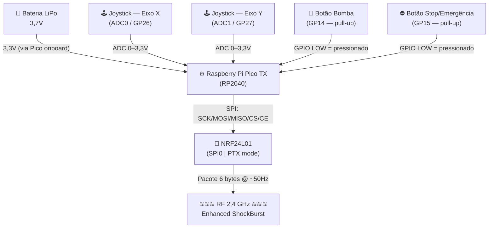
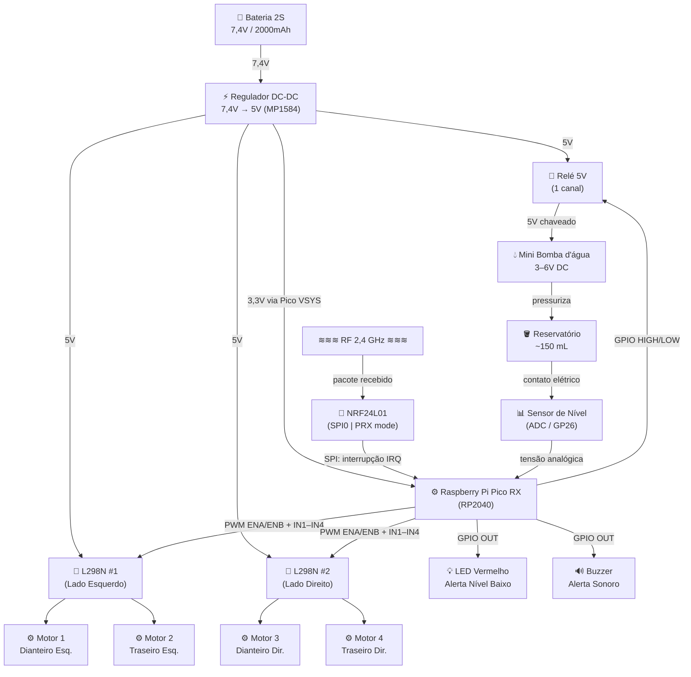
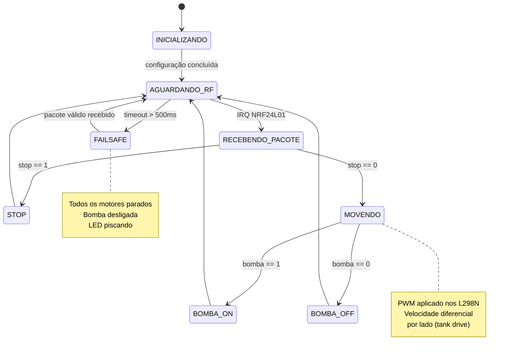

# Diagrama de Blocos — Carro Bombeiro Teleoprado

> Representação detalhada em formato texto e Mermaid do sistema completo.  
> Para renderização visual, abra este arquivo em um visualizador Mermaid (GitHub, VSCode com extensão, Obsidian, etc.)

---

## 1. Diagrama de Blocos Principal (Sistema Completo)

```
╔══════════════════════════════════════════════════════════╗
║              BLOCO TRANSMISSOR (Controle Remoto)         ║
╠══════════════════════════════════════════════════════════╣
║                                                          ║
║   ┌──────────────┐       ┌───────────────────────────┐   ║
║   │ Bateria LiPo │──────▶│  Raspberry Pi Pico (TX)   │   ║
║   │    3,7 V     │       │                           │   ║
║   └──────────────┘       │  ADC0 ◀── Joystick Eixo X │   ║
║                          │  ADC1 ◀── Joystick Eixo Y │   ║
║                          │  GP14 ◀── Botão Bomba     │   ║
║                          │  GP15 ◀── Botão Stop      │   ║
║                          │  SPI0 ──▶ NRF24L01 (TX)   │   ║
║                          └───────────────────────────┘   ║
║                                        │                 ║
║                              NRF24L01 ─┘                 ║
╚══════════════════════════════════════╪═══════════════════╝
                                       │
                               RF 2,4 GHz
                           Enhanced ShockBurst
                                       │
╔══════════════════════════════════════╪═══════════════════╗
║              BLOCO RECEPTOR (Carro Bombeiro)             ║
╠══════════════════════════════════════╪═══════════════════╣
║                              NRF24L01 (RX)               ║
║                                       │ SPI0             ║
║   ┌───────────────┐       ┌───────────▼───────────────┐  ║
║   │  Bateria 2S   │──────▶│  Raspberry Pi Pico (RX)   │  ║
║   │   7,4 V       │       │                           │  ║
║   └───┬───────────┘       │  GP8  PWM ──▶ L298N #1    │  ║
║       │                   │  GP9  PWM ──▶ L298N #1    │  ║
║       ▼                   │  GP10–13 ──▶ L298N #1     │  ║
║  ┌──────────────┐          │  GP16 PWM ──▶ L298N #2    │  ║
║  │ Regulador   │          │  GP17 PWM ──▶ L298N #2    │  ║
║  │ 7,4V → 5V  │          │  GP18–21 ──▶ L298N #2     │  ║
║  └──────┬───────┘          │  GP22     ──▶ Relé 5V     │  ║
║         │                  │  GP26 ADC ◀── Sensor Nív. │  ║
║         │                  │  GP27     ──▶ LED Alerta  │  ║
║         │                  │  GP28     ──▶ Buzzer      │  ║
║         │                  └───────────────────────────┘  ║
║         │                                                  ║
║         ├──────────────────────────────────────────────┐  ║
║         │                                              │  ║
║         ▼                    ▼                         ▼  ║
║   ┌──────────┐        ┌───────────┐            ┌──────────┐║
║   │ L298N #1 │        │ L298N #2  │            │  Relé 5V ││
║   │          │        │           │            └──────────┘║
║   └──┬────┬──┘        └──┬─────┬──┘                 │     ║
║      │    │              │     │                    ▼     ║
║      ▼    ▼              ▼     ▼             ┌──────────┐  ║
║   Motor1 Motor2       Motor3 Motor4          │  Bomba   │  ║
║   (D.Esq)(T.Esq)     (D.Dir)(T.Dir)         │ d'água   │  ║
║                                             └─────┬────┘  ║
║                                                   │       ║
║                                             ┌─────▼────┐  ║
║                          Sensor Nível ◀─────│Reservat. │  ║
║                                             └──────────┘  ║
╚══════════════════════════════════════════════════════════╝
```

---

## 2. Diagrama Mermaid — Subsistema Transmissor



---

## 3. Diagrama Mermaid — Subsistema Receptor



---

## 4. Diagrama de Estados — Receptor (Firmware)



---

## 5. Estrutura do Pacote RF

```
┌─────────┬──────────────────────────────────────────────────┐
│  Byte   │  Descrição                                        │
├─────────┼──────────────────────────────────────────────────┤
│    0    │  vel_esq  — int8  — velocidade lado esq. (−100..+100) │
│    1    │  vel_dir  — int8  — velocidade lado dir. (−100..+100) │
│    2    │  bomba    — uint8 — 0=OFF, 1=ON                   │
│    3    │  stop     — uint8 — 0=normal, 1=parada emergência │
│    4    │  reservado                                        │
│    5    │  reservado                                        │
└─────────┴──────────────────────────────────────────────────┘
Tamanho total: 6 bytes (campo fixo — NRF24L01 static payload)
Taxa: ~50 pacotes/segundo (período de 20 ms no TX)
```

---

## 6. Diagrama de Alimentação

```
Bateria 2S (7,4V)
       │
       ├──[Regulador DC-DC MP1584]──→ 5V ──┬── L298N #1 (VCC lógico)
       │                                   ├── L298N #2 (VCC lógico)
       │                                   ├── Relé 5V (bobina)
       │                                   └── Pico (VSYS → regulador 3,3V interno)
       │                                            │
       │                                           3,3V ──── NRF24L01 VCC
       │
       └──[Direto 7,4V]──→ L298N #1 e #2 (pino VS — potência dos motores)
                           (corrente pico ~2A por driver, 4A total)
```

---

*Arquivo gerado em 11 de março de 2026 — EEN251 Projeto Semestral.*
