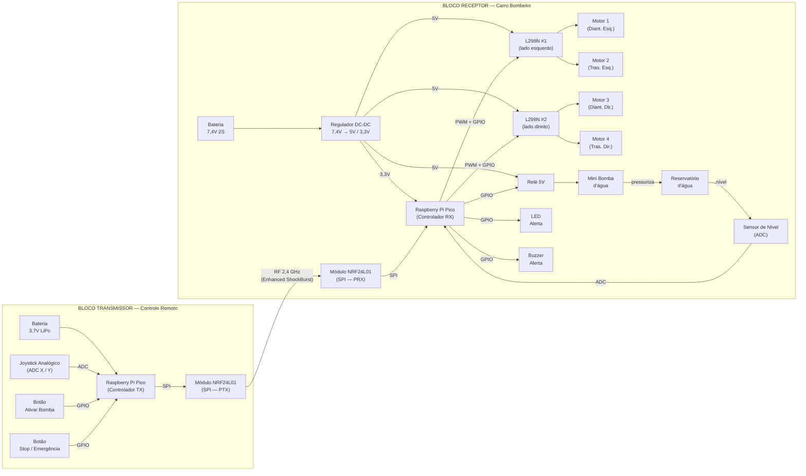
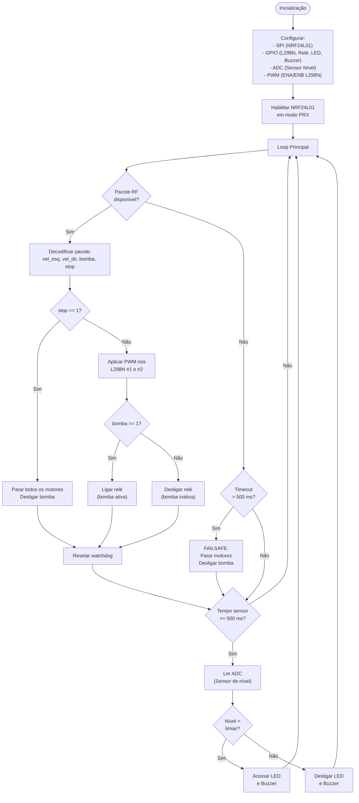

# EEN251 — Projeto Semestral: Carro de Bombeiro Teleoprado

> **Disciplina:** EEN251 — Projeto Integrador de Sistemas Embarcados  
> **Semestre:** 1º Semestre / 2026  
> **Data de início:** Março de 2026

---

## Sumário

1. [Integrantes e Responsabilidades](#1-integrantes-e-responsabilidades)
2. [Descrição Geral do Projeto](#2-descrição-geral-do-projeto)
3. [Objetivos](#3-objetivos)
4. [Materiais e Componentes](#4-materiais-e-componentes)
5. [Arquitetura do Sistema](#5-arquitetura-do-sistema)
6. [Diagrama de Blocos](#6-diagrama-de-blocos)
7. [Pinagem e Conexões](#7-pinagem-e-conexões)
8. [Firmware — Descrição e Fluxograma de Estados](#8-firmware--descrição-e-fluxograma-de-estados)
9. [Cronograma](#9-cronograma)
10. [Orçamento Total Estimado](#10-orçamento-total-estimado)
11. [Riscos e Limitações](#11-riscos-e-limitações)
12. [Referências Bibliográficas](#12-referências-bibliográficas)

---

## 1. Integrantes e Responsabilidades

| Nome | RA | Função Principal |
|------|----|-----------------|
| Felipe Fazio da Costa | 23.00055-4 | Firmware do Receptor (Pico RX) — motores e bomba |
| João Gabriel Fioruci Roberto | 23.00617-0 | Firmware do Transmissor (Pico TX) — controle RF |
| Gabriel Rodrigues Marques | 23.00578-5 | Hardware — montagem do chassi e fiação |
| Fábio Sadao Sato | 22.00984-0 | Integração do sistema e documentação |

---

## 2. Descrição Geral do Projeto

O projeto consiste no desenvolvimento de um veículo robótico em escala inspirado em um caminhão de bombeiro, capaz de se locomover de maneira teleoprada por meio de comunicação sem fio RF 2.4 GHz (módulo NRF24L01). O veículo é dotado de tração 4WD com quatro motores DC controlados por dois módulos L298N, uma mini bomba d'água acionável remotamente, e um reservatório de água com sensor de nível que alerta o operador quando a água estiver baixa.

O sistema é dividido em dois blocos principais:

- **Transmissor (controle remoto):** baseado em um Raspberry Pi Pico com joystick analógico, botões e display OLED SSD1306, responsável por capturar os comandos do operador e enviá-los via NRF24L01.
- **Receptor (carro):** baseado em um segundo Raspberry Pi Pico que recebe os pacotes RF, interpreta os comandos e aciona os motores, a bomba e os alertas de nível.

Todo o firmware é desenvolvido em MicroPython, aproveitando a plataforma Raspberry Pi Pico (microcontrolador RP2040) como base de hardware.

---

## 3. Objetivos

O objetivo geral deste trabalho é projetar e construir um veículo robótico controlado remotamente via radiofrequência, capaz de realizar manobras de locomoção e acionamento de uma bomba d'água, com monitoramento de status em tempo real.

### 3.1 Objetivos Específicos

- Implementação de comunicação bidirecional robusta entre controle e veículo;
- Controle de tração diferencial (tank drive) para quatro motores;
- Sistema de alerta de nível de água com indicadores visuais e sonoros;
- Desenvolvimento de firmware em MicroPython para a plataforma Raspberry Pi Pico.

---

## 4. Materiais e Componentes

| Qtd | Componente | Finalidade | Preço Est. (R$) |
|-----|-----------|-----------|:--------------:|
| 2 | Raspberry Pi Pico (RP2040) | Controlador central — TX e RX | 35,00 cada |
| 4 | Motor DC 3–6 V com caixa de redução (TT Motor) | Tração 4WD do veículo | 8,00 cada |
| 2 | Módulo L298N (ponte H dupla) | Driver de corrente para os motores | 15,00 cada |
| 2 | Módulo NRF24L01 (PA+LNA opcional) | Comunicação RF 2.4 GHz | 12,00 cada |
| 1 | Mini bomba d'água submersa 3–6 V | Jato d'água do caminhão | 18,00 |
| 1 | Módulo relé 5 V (1 canal) | Chaveamento de corrente da bomba | 6,00 |
| 1 | Sensor de nível d'água (resistivo/capacitivo) | Monitorar volume no reservatório | 5,00 |
| 1 | Chassi 4WD em acrílico ou MDF | Estrutura física do veículo | 45,00 |
| 1 | Bateria LiPo 3,7 V 1000 mAh (18650) | Alimentação do transmissor | 25,00 |
| 1 | Pack 2S 18650 (7,4 V ~2000 mAh) | Alimentação principal do carro | 40,00 |
| 1 | Módulo redutor DC-DC (MP1584 ou LM2596) | Regular 7,4 V → 5 V para periféricos | 8,00 |
| 1 | Joystick analógico duplo eixo (KY-023) | Controle direcional (X/Y) | 12,00 |
| 2 | Push button (6 mm) | Ativar bomba / parada de emergência | 1,00 cada |
| 1 | Reservatório plástico (aprox. 100–200 mL) | Tanque de água do caminhão | 10,00 |
| 1 | Protoboard ou PCB de prototipagem | Prototipagem do circuito | 15,00 |
| — | Jumpers, fios, resistores, LEDs, buzzer, suportes | Conexões e indicadores | 20,00 |

---

## 5. Arquitetura do Sistema

O sistema é composto por dois subsistemas independentes que se comunicam exclusivamente via RF:

**Subsistema Transmissor** — opera de forma autônoma lendo os sensores de entrada (joystick e botões), convertendo-os em pacotes de dados e transmitindo-os pelo NRF24L01 em modo PTX (*Primary TX*). O Pico TX fica em loop contínuo lendo ADC e GPIO, monta o pacote e envia a cada ~20 ms (~50 Hz de atualização).

**Subsistema Receptor** — o Pico RX opera em modo PRX (*Primary RX*), aguardando pacotes. Ao receber um pacote válido, decodifica os campos (velocidade_esquerda, velocidade_direita, bomba_on) e aciona os respectivos periféricos via PWM (motores) e GPIO digital (relé). Em paralelo, a leitura do sensor de nível é feita periodicamente pelo ADC, e alertas são acionados se o nível cair abaixo de um limiar pré-definido.

A comunicação RF utiliza protocolo `Enhanced ShockBurst` nativo do NRF24L01, com confirmação automática de recebimento (ACK), minimizando a necessidade de tratamento de erros no firmware.

---

## 6. Diagrama de Blocos

### 6.1 Visão Geral do Sistema



### 6.2 Fluxo de Comunicação RF

```
[Joystick X/Y + Botões]
        |
        v
  Pico TX: leitura ADC/GPIO (20 ms)
        |
        v
  Monta pacote: { vel_esq, vel_dir, bomba }  (6 bytes)
        |
        v
  NRF24L01 TX  ----[ RF 2,4 GHz ]---->  NRF24L01 RX
                                               |
                                               v
                                   Pico RX: decodifica pacote
                                               |
                          +--------------------+--------------------+
                          |                    |                    |
                          v                    v                    v
                   PWM L298N #1        PWM L298N #2           GPIO Relé
                  (Motor 1 e 2)       (Motor 3 e 4)           (Bomba)
```

---

## 7. Pinagem e Conexões

### 7.1 Receptor — Raspberry Pi Pico (RX)

| Pino | GPIO | Periférico | Sinal | Obs. |
|------|:----:|-----------|-------|------|
| GP0 | 0 | L298N | IN1 | Direção Motor Esq |
| GP1 | 1 | L298N | IN2 | Direção Motor Esq |
| GP2 | 2 | L298N | IN3 | Direção Motor Dir |
| GP3 | 3 | L298N | IN4 | Direção Motor Dir |
| GP4 | 4 | NRF24L01 | MISO (SPI0) | Dados entrada |
| GP5 | 7 | NRF24L01 | CSn | Chip Select |
| GP6 | 4 | NRF24L01 | SCK (SPI0) | Clock SPI |
| GP7 | 11 | NRF24L01 | MOSI (SPI0) | Dados saída |
| GP8 | 29 | Relé Bomba | Sinal | Ativa bomba |
| GP9 | 11 | L298N | ENA (PWM) | Vel. Motor Esq |
| GP10 | 12 | L298N | ENB (PWM) | Vel. Motor Dir |
| GP12 | 6 | NRF24L01 | CE | Chip Enable |
| GP13 | 32 | LED Indicador | GPIO OUT | Status sinal |
| GP22 | 34 | Sensor Nível (D) | GPIO IN | Alerta digital |
| GP27 | 31 | Sensor Nível (A) | ADC1 | Leitura analógica |

### 7.2 Transmissor — Raspberry Pi Pico (TX)

| Pino | GPIO | Periférico | Sinal | Obs. |
|------|:----:|-----------|-------|------|
| GP0 | 0 | Display OLED | I2C SDA | Dados I2C |
| GP1 | 1 | Display OLED | I2C SCL | Clock I2C |
| GP4 | 6 | NRF24L01 | MISO (SPI0) | Dados entrada |
| GP5 | 7 | NRF24L01 | CSn | Chip Select |
| GP6 | 4 | NRF24L01 | SCK (SPI0) | Clock SPI |
| GP7 | 5 | NRF24L01 | MOSI (SPI0) | Dados saída |
| GP9 | 9 | NRF24L01 | CE | Chip Enable |
| GP19 | 19 | Botão Bomba | GPIO IN | Pull-up interno |
| GP26 | 32 | Joystick Y | ADC1 | Eixo vertical |
| GP27 | 31 | Joystick X | ADC0 | Eixo horizontal |

> **Nota:** O NRF24L01 opera em 3,3 V. Os pinos GPIO do Raspberry Pi Pico também operam em 3,3 V — compatibilidade direta, sem necessidade de divisor de tensão.

---

## 8. Firmware — Descrição e Fluxograma de Estados

### 8.1 Transmissor (Pico TX)

O firmware do transmissor opera em loop contínuo com período de ~20 ms:

1. Lê os valores analógicos do joystick (ADC0 e ADC1), mapeando a faixa 0–65535 para –100 a +100 (porcentagem de velocidade).
2. Aplica uma zona morta central (deadzone) para evitar movimento indesejado quando o joystick está na posição de repouso.
3. Lê o estado dos botões (pull-up interno; nível lógico 0 = pressionado).
4. Calcula os valores de velocidade para o lado esquerdo e direito com base no mapeamento *tank drive* (Y = avanço/recuo, X = giro).
5. Monta o pacote de 6 bytes: `[ vel_esq (int8), vel_dir (int8), bomba (uint8), stop (uint8), reservado, reservado ]`.
6. Transmite o pacote via NRF24L01 em modo PTX com ACK habilitado.

### 8.2 Receptor (Pico RX)

O firmware do receptor opera com duas tarefas cooperativas:

- **Tarefa RF (alta prioridade):** aguarda interrupção do NRF24L01 indicando pacote disponível. Ao receber, decodifica os campos e aplica imediatamente os comandos de PWM nos L298N e o sinal no relé.
- **Tarefa Sensor (baixa prioridade):** lê o ADC do sensor de nível a cada 500 ms. Se o valor lido estiver abaixo do limiar configurado, aciona LED e buzzer.
- **Watchdog:** se nenhum pacote RF válido for recebido em 500 ms, todos os motores são desligados (failsafe).

### 8.3 Fluxograma do Firmware — Receptor



### 8.4 Mapeamento Tank Drive

A conversão do joystick analógico para velocidade diferencial dos motores segue o modelo *tank drive*:

```
vel_esq = Y + X
vel_dir = Y − X
```

Onde Y representa o eixo de avanço/recuo e X o eixo de rotação. Os valores são limitados ao intervalo [−100, +100] e convertidos para duty cycle PWM (0–65535 no RP2040).

---

## 9. Cronograma

| Semana | Período | Etapa | Responsável | Status |
|:------:|---------|-------|-------------|:------:|
| 1–2 | 11/03 – 22/03 | Levantamento de requisitos, aquisição de componentes | Todos | Pendente |
| 3–4 | 23/03 – 05/04 | Montagem do chassi 4WD e fiação dos motores + L298N | [Nome 3] | Pendente |
| 5–6 | 06/04 – 19/04 | Configuração e teste da comunicação RF (NRF24L01 + Pico) | [Nome 2] | Pendente |
| 7–8 | 20/04 – 03/05 | Firmware do receptor: controle de motores via PWM | [Nome 1] | Pendente |
| 9–10 | 04/05 – 17/05 | Integração da bomba d'água, relé e sensor de nível | [Nome 1] | Pendente |
| 11–12 | 18/05 – 31/05 | Integração geral do sistema e testes de validação | Todos | Pendente |
| 13–14 | 01/06 – 14/06 | Ajustes finais, failsafe, calibração de parâmetros | Todos | Pendente |
| 15 | 15/06 – 21/06 | Preparação da apresentação e finalização da documentação | [Nome 4] | Pendente |
| 16 | 22/06+ | Apresentação final | Todos | Pendente |

---

## 10. Orçamento Total Estimado

| Categoria | Itens | Subtotal (R$) |
|-----------|-------|:------------:|
| Microcontroladores | 2× Raspberry Pi Pico | 70,00 |
| Motores e driver | 4× Motor DC + 2× L298N | 62,00 |
| Comunicação RF | 2× NRF24L01 | 24,00 |
| Sistema de água | Bomba + Relé + Sensor + Reservatório | 39,00 |
| Alimentação | 2× Baterias + Regulador DC-DC | 73,00 |
| Estrutura | Chassi 4WD + Protoboard | 60,00 |
| Controle | Joystick + Botões | 14,00 |
| Miscelânea | Jumpers, LEDs, buzzer, fios, resistores | 20,00 |
| **TOTAL** | | **R$ 362,00** |

> Os preços são estimativas baseadas em valores de mercado nacional (Mercado Livre, Baú da Eletrônica, Robocore) em março de 2026 e podem variar conforme fornecedor e frete.

---

## 11. Riscos e Limitações

- **Alcance do NRF24L01:** em ambiente interno com obstáculos, o alcance efetivo pode ser inferior a 15–20 m. A versão PA+LNA eleva o alcance para ~100 m em campo aberto.
- **Impermeabilização:** os componentes eletrônicos devem ser protegidos contra respingos da bomba d'água. Recomenda-se posicionar a eletrônica distante do bico de saída da bomba.
- **Autonomia da bateria:** com 4 motores + bomba em operação simultânea, a corrente pode ultrapassar 2 A. A bateria 2S deve ter capacidade suficiente (>2000 mAh) para operação de ~20–30 minutos.
- **Aquecimento do L298N:** o L298N possui eficiência de ~70%. Em operação de alta carga, o dissipador de alumônio incluído no módulo pode ser insuficiente — monitorar temperatura em testes prolongados.
- **Latência RF:** o protocolo Enhanced ShockBurst do NRF24L01 adiciona latência de ~1–2 ms por pacote. Para controle em malha aberta (sem encoder), isso é aceitável.
- **Compatibilidade de tensão:** NRF24L01 opera em 3,3 V. O RPi Pico já opera em 3,3 V, mas atenção ao não conectar o VCC do módulo ao pino 5V por engano.
- **Sensor de nível resistivo:** sensores resistivos têm vida útil reduzida pela corrosão dos eletrodos. Para uso prolongado, considerar sensor capacitivo ou optoeletrônico.

---

## 12. Referências Bibliográficas

1. **Raspberry Pi Ltd.** *Raspberry Pi Pico Datasheet*. Disponível em: [https://datasheets.raspberrypi.com/pico/pico-datasheet.pdf](https://datasheets.raspberrypi.com/pico/pico-datasheet.pdf). Acesso em: mar. 2026.

2. **Raspberry Pi Ltd.** *RP2040 Datasheet*. Disponível em: [https://datasheets.raspberrypi.com/rp2040/rp2040-datasheet.pdf](https://datasheets.raspberrypi.com/rp2040/rp2040-datasheet.pdf). Acesso em: mar. 2026.

3. **STMicroelectronics.** *L298N Dual Full-Bridge Driver Datasheet*. Disponível em: [https://www.st.com/resource/en/datasheet/l298.pdf](https://www.st.com/resource/en/datasheet/l298.pdf). Acesso em: mar. 2026.

4. **Nordic Semiconductor.** *nRF24L01+ Product Specification v1.0*. Disponível em: [https://www.nordicsemi.com/products/nrf24l01](https://www.nordicsemi.com/products/nrf24l01). Acesso em: mar. 2026.

5. **MicroPython Project.** *MicroPython Documentation for RP2*. Disponível em: [https://docs.micropython.org/en/latest/rp2/quickref.html](https://docs.micropython.org/en/latest/rp2/quickref.html). Acesso em: mar. 2026.

6. **Micropython-nrf24l01 Library.** Disponível em: [https://github.com/micropython/micropython-lib/tree/master/micropython/drivers/radio/nrf24l01](https://github.com/micropython/micropython-lib/tree/master/micropython/drivers/radio/nrf24l01). Acesso em: mar. 2026.

---

*Documento gerado em 11 de março de 2026.*
